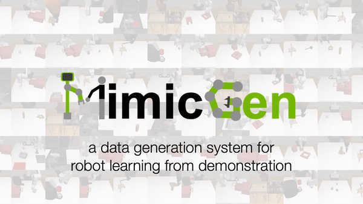

# MimicGen Environments and Datasets

<p align="center">
  <!--  -->
  
</p>

This repository contains the official release of simulation environments and datasets for the [CoRL 2023](https://www.corl2023.org/) paper "MimicGen: A Data Generation System for Scalable Robot Learning using Human Demonstrations". 

The datasets contain over 48,000 task demonstrations across 12 tasks.

Website: https://mimicgen.github.io

Paper: https://arxiv.org/abs/2310.17596

For business inquiries, please submit this form: [NVIDIA Research Licensing](https://www.nvidia.com/en-us/research/inquiries/)

-------
## Latest Updates
- [04/04/2024] **v0.1.1**: Dataset license changed to [CC-BY 4.0](https://creativecommons.org/licenses/by/4.0/), which is less restrictive (see [License](#license))
- [09/28/2023] **v0.1.0**: Initial code and paper release

-------


## Table of Contents

- [Installation](#installation)
- [Downloading and Using Datasets](#downloading-and-using-datasets)
- [Reproducing Policy Learning Results](#reproducing-policy-learning-results)
- [Task Visualizations](#task-visualizations)
- [Data Generation Code](#data-generation-code)
- [Troubleshooting and Known Issues](#troubleshooting-and-known-issues)
- [License](#license)
- [Citation](#citation)


## Installation

We recommend installing the repo into a new conda environment (it is called `mimicgen` in the example below):

```sh
conda create -n mimicgen python=3.8
conda activate mimicgen
```

You can install most of the dependencies by cloning the repository and then installing from source:

```sh
cd <PATH_TO_YOUR_INSTALL_DIRECTORY>
git clone https://github.com/NVlabs/mimicgen_environments.git
cd mimicgen_environments
pip install -e .
```

However, there are some additional dependencies that we list below. These are best installed from source:

- [robosuite](https://robosuite.ai/)
    - **Installation**
      ```sh
      cd <PATH_TO_YOUR_INSTALL_DIRECTORY>
      git clone https://github.com/ARISE-Initiative/robosuite.git
      git checkout b9d8d3de5e3dfd1724f4a0e6555246c460407daa
      cd robosuite
      pip install -e .
      ```
    - **Note**: the git checkout command corresponds to the commit we used for testing our policy learning results. In general the `master` branch (`v1.4+`) should be fine.
    - For more detailed instructions, see [here](https://robosuite.ai/docs/installation.html)
- [robomimic](https://robomimic.github.io/)
    - **Installation**
      ```sh
      cd <PATH_TO_YOUR_INSTALL_DIRECTORY>
      git clone https://github.com/ARISE-Initiative/robomimic.git
      git checkout ab6c3dcb8506f7f06b43b41365e5b3288c858520
      cd robomimic
      pip install -e .
      ```
    - **Note**: the git checkout command corresponds to the commit we used for testing our policy learning results. In general the `master` branch (`v0.3+`) should be fine.
    - For more detailed instructions, see [here](https://robomimic.github.io/docs/introduction/installation.html)
- [robosuite_task_zoo](https://github.com/ARISE-Initiative/robosuite-task-zoo)
    - **Note**: This is optional and only needed for the Kitchen and Hammer Cleanup environments / datasets.
    - **Installation**
      ```sh
      cd <PATH_TO_YOUR_INSTALL_DIRECTORY>
      git clone https://github.com/ARISE-Initiative/robosuite-task-zoo
      git checkout 74eab7f88214c21ca1ae8617c2b2f8d19718a9ed
      cd robosuite_task_zoo
      pip install -e .
      ```

Lastly, **please downgrade MuJoCo to 2.3.2**:
```sh
pip install mujoco==2.3.2
```

**Note**: This MuJoCo version (`2.3.2`) is important -- in our testing, we found that other versions of MuJoCo could be problematic, especially for the Sawyer arm datasets (e.g. `2.3.5` causes problems with rendering and `2.3.7` changes the dynamics of the robot arm significantly from the collected datasets).

### Test Your Installation

The following script can be used to try random actions in a task.
```sh
cd mimicgen_envs/scripts
python demo_random_action.py
```

## Downloading and Using Datasets

### Dataset Types

As described in the paper, each task has a default reset distribution (D_0). Source human demonstrations (usually 10 demos) were collected on this distribution and MimicGen was subsequently used to generate large datasets (usually 1000 demos) across different task reset distributions (e.g. D_0, D_1, D_2), objects, and robots.

The datasets are split into different types:

- **source**: source human datasets used to generate all data -- this generally consists of 10 human demonstrations collected on the D_0 variant for each task.
- **core**: datasets generated with MimicGen for different task reset distributions. These correspond to the core set of results in Figure 4 of the paper.
- **object**: datasets generated with MimicGen for different objects. These correspond to the results in Appendix G of the paper.
- **robot**: datasets generated with MimicGen for different robots. These correspond to the results in Appendix F of the paper.
- **large_interpolation**: datasets generated with MimicGen using much larger interpolation segments. These correspond to the results in Appendix H in the paper.

**Note 1**: All datasets are readily compatible with [robomimic](https://robomimic.github.io/) --- the structure is explained [here](https://robomimic.github.io/docs/datasets/overview.html#dataset-structure). This means that you can use robomimic to [visualize the data](https://robomimic.github.io/docs/tutorials/dataset_contents.html) or train models with different policy learning methods that we did not explore in our paper, such as [BC-Transformer](https://robomimic.github.io/docs/tutorials/training_transformers.html).

**Note 2**: We found that the large_interpolation datasets pose a significant challenge for imitation learning, and have substantial room for improvement.

### Dataset Statistics

The datasets contain over 48,000 task demonstrations across 12 tasks.

We provide more information on the amount of demonstrations for each dataset type:
- **source**: 120 human demonstrations across 12 tasks (10 per task) used to automatically generate the other datasets
- **core**: 26,000 task demonstrations across 12 tasks (26 task variants)
- **object**: 2000 task demonstrations on the Mug Cleanup task with different mugs
- **robot**: 16,000 task demonstrations across 4 different robot arms on 2 tasks (4 task variants)
- **large_interpolation**: 6000 task demonstrations across 6 tasks that pose significant challenges for modern imitation learning methods

### Dataset Download

#### Method 1: Using `download_datasets.py` (Recommended)

`download_datasets.py` (located at `mimicgen_envs/scripts`) is a python script that provides a programmatic way of downloading the datasets. This is the preferred method, because this script also sets up a directory structure for the datasets that works out of the box with the code for reproducing policy learning results.

A few examples of using this script are provided below:

```sh
# default behavior - just download core square_d0 dataset
python download_datasets.py

# download core datasets for square D0, D1, D2 and coffee D0, D1, D2
python download_datasets.py --dataset_type core --tasks square_d0 square_d1 square_d2 coffee_d0 coffee_d1 coffee_d2

# download all core datasets, but do a dry run first to see what will be downloaded and where
python download_datasets.py --dataset_type core --tasks all --dry_run

# download all source human datasets
python download_datasets.py --dataset_type source --tasks all
```

#### Method 2: Using Direct Download Links

You can download the datasets manually through Google Drive. The folders each correspond to the dataset types described in [Dataset Types](#dataset-types).

**Google Drive folder with all datasets:** [link](https://drive.google.com/drive/folders/14e9kkHGfApuQ709LBEbXrXVI1Lp5Ax7p?usp=drive_link)

#### Method 3: Using Hugging Face

You can download the datasets through Hugging Face.

**Hugging Face dataset repository:** [link](https://huggingface.co/datasets/amandlek/mimicgen_datasets)

## Reproducing Policy Learning Results

After downloading the appropriate datasets you’re interested in using by running the `download_datasets.py` script, the `generate_training_configs.py` script (located at `mimicgen_envs/scripts`) can be used to generate all training config json files necessary to reproduce the experiments in the paper. A few examples are below.

```sh
# Assume datasets already exist in mimicgen_envs/../datasets folder. Configs will be generated under mimicgen_envs/exps/paper, and training results will be at mimicgen_envs/../training_results after launching training runs.
python generate_training_configs.py

# Alternatively, specify where datasets exist, and specify where configs should be generated.
python generate_training_configs.py --config_dir /tmp/configs --dataset_dir /tmp/datasets --output_dir /tmp/experiment_results
```

Then, to reproduce a specific set of training runs for different experiment groups (see [Dataset Types](#dataset-types)), we can simply navigate to the generated config directory, and copy training commands from the generated shell script there. As an example, we can reproduce the image training results on the Coffee D0 dataset, by looking for the correct set of commands in `mimicgen_envs/exps/paper/core.sh` and running them. The relevant section of the shell script is reproduced below.

```sh
#  task: coffee_d0
#    obs modality: image
python /path/to/robomimic/scripts/train.py --config /path/to/mimicgen_envs/exps/paper/core/coffee_d0/image/bc_rnn.json
```

**Note 1**: Another option is to directly run `robomimic/scripts/train.py` with any generated config jsons of interest -- the commands in the shell files do exactly this.

**Note 2**: See the [robomimic documentation](https://robomimic.github.io/docs/introduction/getting_started.html) for more information on how training works.

**Note 3**: In the MimicGen paper, we generated our datasets on versions of environments built on robosuite `v1.2`. Since then, we changed the environments and datasets (through postprocessing) to be based on robosuite `v1.4`. However, `v1.4` has some visual and dynamics differences from `v1.2`, so the learning results may not exactly match up with the ones we reported in the paper. In our testing on these released datasets, we were able to reproduce nearly all of our results, but within 10% of the performance reported in the paper.


## Task Visualizations

We provide a convenience script to write videos for each task's reset distribution at `scripts/get_reset_videos.py`. Set the `OUTPUT_FOLDER` global variable to the folder where you want to write the videos, and set `DATASET_INFOS` appropriately if you would like to limit the environments visualized. Then run the script.

The environments are also readily compatible with robosuite visualization scripts such as the [demo_random_action.py](https://github.com/ARISE-Initiative/robosuite/blob/b9d8d3de5e3dfd1724f4a0e6555246c460407daa/robosuite/demos/demo_random_action.py) script and the [make_reset_video.py](https://github.com/ARISE-Initiative/robosuite/blob/b9d8d3de5e3dfd1724f4a0e6555246c460407daa/robosuite/scripts/make_reset_video.py) script, but you will need to modify these files to add a `import mimicgen_envs` line to make sure that `robosuite` can find these environments.


**Note**: You can find task reset visualizations on the [website](https://mimicgen.github.io), but they may look a little different as they were generated with robosuite v1.2.

## Data Generation Code

If you are interested in the data generation code, please send an email to amandlekar@nvidia.com. Thanks!

## Troubleshooting and Known Issues

- If your robomimic training seems to be proceeding slowly (especially for image-based agents), it might be a problem with robomimic and more modern versions of PyTorch. We recommend PyTorch 1.12.1 (on Ubuntu, we used `conda install pytorch==1.12.1 torchvision==0.13.1 torchaudio==0.12.1 cudatoolkit=11.3 -c pytorch`). It is also a good idea to verify that the GPU is being utilized during training.
- In our testing on M1 macbook we ran into the following error when using `imageio-ffmpeg` installed through pip: `RuntimeError: No ffmpeg exe could be found. Install ffmpeg on your system, or set the IMAGEIO_FFMPEG_EXE environment variable.` Using `conda install imageio-ffmpeg` fixed this issue on our end.
- If you run into trouble with installing [egl_probe](https://github.com/StanfordVL/egl_probe) during robomimic installation (e.g. `ERROR: Failed building wheel for egl_probe`) you may need to make sure `cmake` is installed. A simple `pip install cmake` should work.
- If you run into other strange installation issues, one potential fix is to launch a new terminal, activate your conda environment, and try the install commands that are failing once again. One clue that the current terminal state is corrupt and this fix will help is if you see installations going into a different conda environment than the one you have active.
- If you run into rendering issues with the Sawyer robot arm, or have trouble reproducing our results, your MuJoCo version might be the issue. As noted in the [Installation](#installation) section, please use MuJoCo 2.3.2 (`pip install mujoco==2.3.2`).

If you run into an error not documented above, please search through the [GitHub issues](https://github.com/NVlabs/mimicgen_environments/issues), and create a new one if you cannot find a fix.

## License

The code is released under the [NVIDIA Source Code License](https://github.com/NVlabs/mimicgen_environments/blob/main/LICENSE) and the datasets are released under [CC-BY 4.0](https://creativecommons.org/licenses/by/4.0/).

## Citation

Please cite [the MimicGen paper](https://arxiv.org/abs/2310.17596) if you use this code in your work:

```bibtex
@inproceedings{mandlekar2023mimicgen,
    title={MimicGen: A Data Generation System for Scalable Robot Learning using Human Demonstrations},
    author={Mandlekar, Ajay and Nasiriany, Soroush and Wen, Bowen and Akinola, Iretiayo and Narang, Yashraj and Fan, Linxi and Zhu, Yuke and Fox, Dieter},
    booktitle={7th Annual Conference on Robot Learning},
    year={2023}
}
```
